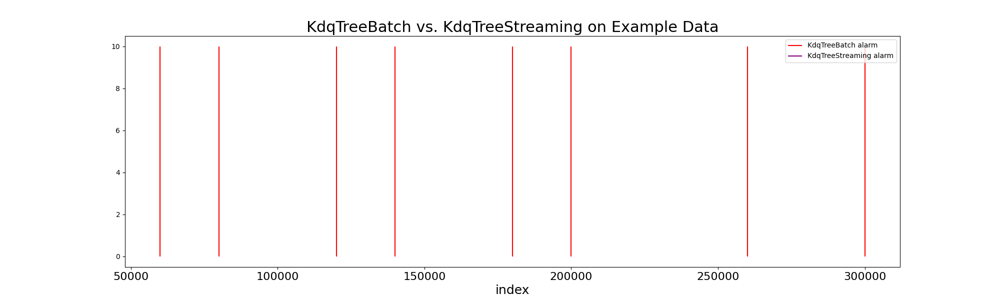

*benchmarking under development*

# Menelaus Detectors & Baselines

##  Overview

This file houses benchmarking results for a variety of algorithms available under `menelaus`, to establish baselines for detector efficacy and efficiency. 

## Runtimes

*TODO*
- determine if/how detecting power of each algorithm can be tabulated
- plot of runtime over increasing data size may be needed
- tables may eventually need to be generated through HTML

### Using "Example" Dataset

| Detector | Category  | Runtime (total s) | Runtime (s/update) |
| -------- | --------- | ----------------- | ------------------ |
| KdqTree  | batch     | TBD         | TBD                 |
| KdqTree  | streaming | TBD         | TBD                 |

## Detector Efficacy

